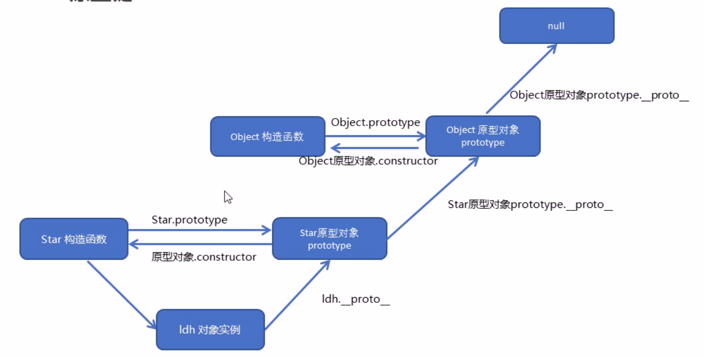

# 四、原型

## 001 - 对原型、原型链的理解



在JavaScript中是使用构造函数来初始化一个对象的，每一个构造函数的内部都有一个 `prototype`（原型对象）
属性，它的属性值是一个对象，这个对象包含了可以由该构造函数的所有实例共享的属性和方法。当使用构造函数新建一个对象后，在这个对象的内部将包含一个指针，这个指针指向构造函数的 prototype 属性对应的值，在 ES5
中这个指针被称为对象的原型。一般来说不应该能够获取到这个值的，但是现在浏览器中都实现了 `__proto__` 属性来访问这个属性（prototype原型对象），但是最好不要使用这个属性，因为它不是规范中规定的。ES5 中新增了一个
`Object.getPrototypeOf()`
方法，可以通过这个方法来获取对象的原型。当访问一个对象的属性时，如果这个对象内部不存在这个属性，那么它就会去它的原型对象里找这个属性，这个原型对象又会有自己的原型，于是就这样一直找下去，也就是原型链的概念。原型链的尽头一般来说都是
Object.prototype（除null外）

## 002 - 原型修改、重写

修改：并没有改变构造函数原型对象内部的 `constructor` 指向，只是在原型对象身上新增了属性或者方法

```javascript
function Person(name) {
    this.name = name
}
Person.prototype.getName = function () {}
const p = new Person('tom')
console.log(p.__proto__ === Person.prototype) // true
console.log(p.__proto__ === p.constructor.prototype) // true
```

重写：将构造函数的原型对象直接进行替换，修改了构造函数内部constructor的指向，若想仍然指向原来的构造函数，需要在修改的原型对象内部重新将constructor指向该构造函数

```javascript

```

## 003 - 原型链指向

-

## 004 - 原型链的终点是什么？如何打印出原型链的终点？

- 原型链的终点

    - 由于Object是构造函数，原型链终点是Object.prototype.__proto__，而Object.prototype.__proto__=== null // true，所以，原型链的终点是null

- 如何打印出原型链的终点

    - 原型链上的所有原型都是对象，所有的对象最终都是由Object构造的，而Object.prototype的下一级是Object.prototype.__proto__

        -

### **如何获得对象非原型链上的属性？**

- 使用hasOwnProperty()方法来判断属性是否属于原型链的属性

    -
