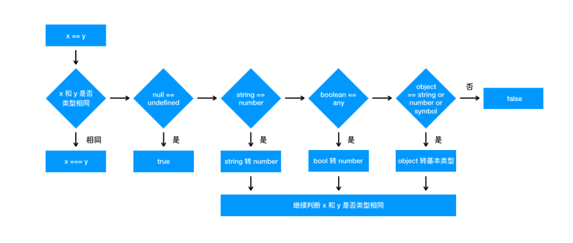

# 一、数据类型

## 001 - JavaScript有哪些数据类型，它们的区别？

**基本数据类型**

- 字符串`String`
- 数字型`Number`
- 布尔型`Boolean`
- 未定义`undefined`
- `Null`
- `Symbol` (ES6新增)

**引用数据类型**

- 对象型`Object`
- 数组型`Array`
- 函数型`Function`
- `Date`
- `Math`
- 正则`RegExp`
- `Map`(ES6新增)
- `Set`(ES6新增)

**区别**

两种类型的区别在于存储位置的不同

- 基本数据类型直接存储在栈（stack）中的简单数据段，占据空间小、大小固定，属于被频繁使用数据，所以放入栈中存储
- 引用数据类型存储在堆（heap）中的对象，占据空间大、大小不固定。如果存储在栈中，将会影响程序运行的性能；
  引用数据类型在栈中存储了指针，该指针指向堆中该实体的起始地址。当解释器寻找引用值时，会首先检索其在栈中的地址，取得地址后从堆中获得实体

## 002 - 数据类型检测的方式有哪些

**`typeof xxx`**

- 用于检测基本数据类型（除`Null`外，`Null`会被检测为 `object`）
- 检测引用数据类型除（除`function`外，`function`会被检测为`function`）会被检测为`object`
- 返回结果为字符串类型，且类型第一个字母均为小写

```javascript
typeof 1 // 'number'
typeof '1' // 'string'
typeof undefined // 'undefined'
typeof true // 'boolean'
typeof Symbol() // 'symbol'
typeof null // 'object'
typeof [] // 'object'
typeof {} // 'object'
typeof console // 'object'
typeof function () {} // 'function'
```

**`xxx instanceof constructor`**

适用于精准检测引用数据类型

可以正确判断对象的类型，用于检测构造函数的 `prototype` 属性是否出现在某个实例对象的原型链上，`object instanceof constructor`，`object`为实例对象，`constructor`为构造函数

```javascript
console.log(1 instanceof Number) // false
console.log(true instanceof Boolean) // false
console.log('a' instanceof String) // false
console.log([] instanceof Array) // true
console.log(function () {} instanceof Function) // true
console.log({} instanceof Object) // true
```

**`Object.prototype.toString.call()`**

适用于所有数据类型

调用该方法，统一返回格式 `[object Xxx]` 的字符串

```javascript
Object.prototype.toString({}) // '[object Object]'
Object.prototype.toString.call({}) // '[object Object]' 加上call也一样
Object.prototype.toString.call(1) // '[object Number]'
Object.prototype.toString.call('a') // '[object String]'
Object.prototype.toString.call(true) // '[object Boolean]'
Object.prototype.toString.call(function () {}) // '[object Function]'
Object.prototype.toString.call(null) // '[object Null]'
Object.prototype.toString.call(undefined) // '[object Undefined]'
Object.prototype.toString.call(/123/g) // '[object RegExp]'
Object.prototype.toString.call(new Date()) // '[object Date]'
Object.prototype.toString.call([]) // '[object Array]'
Object.prototype.toString.call(document) // '[object HTMLDocument]'
Object.prototype.toString.call(window) // '[object Window]'
```

## 003 - 判断数组的方式有哪些

1. `arr instanceof constructor` 返回布尔值

2. `Object.prototype.toString.call(arr)` 返回 `[object Array]` 的字符串

3. `arr.__proto__ === Array.prototype`(通过原型链做判断) 返回布尔值

4. 通过ES6的`Array.isArray(arr)`做判断 返回布尔值

5. 通过`Array.prototype.isPrototypeOf(arr)` 返回布尔值

## 004 - null和undefined区别

- 首先 `Undefined` 和 `Null` 都是基本数据类型，这两个基本数据类型分别都只有一个值，就是 undefined 和 null。
- undefined 代表的含义是未定义，null 代表的含义是空对象。一般变量声明了但还没有定义的时候会返回 undefined，null主要用于赋值给一些可能会返回对象的变量，作为初始化。

## 005 - 如何获取安全的 undefined 值？

因为 undefined 是一个标识符，所以可以被当作变量来使用和赋值，但是这样会影响 undefined 的正常判断。表达式 void ___ 没有返回值，因此返回结果是 undefined。void
并不改变表达式的结果，只是让表达式不返回值。因此可以用 void 0 来获得 undefined。

## 006 - typeof NaN 的结果是什么？

NaN 指“不是一个数字”（not a number），NaN 是一个“警戒值”（sentinel value，有特殊用途的常规值），用于指出数字类型中的错误情况，即“执行数学运算没有成功，这是失败后返回的结果”。返回的结果为"
number"，NaN 是一个特殊值，它和自身不相等，是唯一一个非自反（自反，reflexive，即 x === x 不成立）的值。而 NaN !== NaN 为 true。

## 007 - isNaN 和 Number.isNaN 函数的区别？

- 函数 isNaN 接收参数后，会尝试将这个参数转换为数值，任何不能被转换为数值的的值都会返回 true，因此非数字值传入也会返回 true ，会影响 NaN 的判断。
- 函数 Number.isNaN 会首先判断传入参数是否为数字，如果是数字再继续判断是否为 NaN ，不会进行数据类型的转换，这种方法对于 NaN 的判断更为准确。

## 008 - == 操作符的强制类型转换规则？



- 首先会判断两者类型是否相同，相同的话就比较两者的大小；
- 类型不相同的话，就会进行类型转换；
- 会先判断是否在对比 null 和 undefined，是的话就会返回 true
- 判断两者类型是否为 string 和 number，是的话就会将字符串转换为 number
- 判断其中一方是否为 boolean，是的话就会把 boolean 转为 number 再进行判断
- 判断其中一方是否为 object 且另一方为 string、number 或者 symbol，是的话就会把 object 转为原始类型再进行判断

## 009 - 其他值到字符串的转换规则？

- Null 和 Undefined 类型 ，null 转换为 "null"，undefined 转换为 "undefined"
- Boolean 类型，true 转换为 "true"，false 转换为 "false"
- Number 类型的值直接转换，不过那些极小和极大的数字会使用指数形式
- Symbol 类型的值直接转换，但是只允许显式强制类型转换，使用隐式强制类型转换会产生错误
- 对普通对象来说，除非自行定义 toString() 方法，否则会调用 toString()（Object.prototype.toString()）来返回内部属性 [[Class]] 的值，如"[object Object]"
  。如果对象有自己的 toString() 方法，字符串化时就会调用该方法并使用其返回值

## 010 - 其他值到数字值的转换规则？

为了将值转换为相应的基本类型值，抽象操作 ToPrimitive 会首先（通过内部操作 DefaultValue）检查该值是否有valueOf()方法。如果有并且返回基本类型值，就使用该值进行强制类型转换。如果没有就使用
toString() 的返回值（如果存在）来进行强制类型转换。如果 valueOf() 和 toString() 均不返回基本类型值，会产生 TypeError 错误。

- Undefined 类型的值转换为 NaN
- Null 类型的值转换为 0
- Boolean 类型的值，true 转换为 1，false 转换为 0
- String 类型的值转换如同使用 Number() 函数进行转换，如果包含非数字值则转换为 NaN，空字符串为 0
- Symbol 类型的值不能转换为数字，会报错
- 对象（包括数组）会首先被转换为相应的基本类型值，如果返回的是非数字的基本类型值，则再遵循以上规则将其强制转换为数字
- 总结

    - 如果值有toString（）方法，则调用该方法并返回结果；null返回“null”，undefined返回“undefined”

## 011 - 其他值到布尔类型的值的转换规则？

**false**

- undefined
- null
- false
- +0、-0 和 NaN
- ""

**true** 除以上外

## 012 - || 和 && 操作符的返回值？

|| 和 && 首先会对第一个操作数执行条件判断，如果其不是布尔值就先强制转换为布尔类型，然后再执行条件判断。

- 对于 || 来说，如果条件判断结果为 true 就返回第一个操作数的值，如果为 false 就返回第二个操作数的值。
- && 则相反，如果条件判断结果为 true 就返回第二个操作数的值，如果为 false 就返回第一个操作数的值。

## 013 - Object.is(value1, value2) 与比较操作符 “===”、“==” 的区别？

- 使用双等号（==）进行相等判断时，如果两边的类型不一致，则会进行强制类型转化后再进行比较
- 使用三等号（===）进行相等判断时，如果两边的类型不一致时，不会做强制类型准换，直接返回 false
- 使用 Object.is 来进行相等判断时，一般情况下和三等号的判断相同，它处理了一些特殊的情况，比如 -0 和 +0 不再相等，两个 NaN 是相等的

## 014 - 什么是 JavaScript 中的包装类型？

在 JavaScript 中，基本类型是没有属性和方法的，但是为了便于操作基本类型的值，在调用基本类型的属性或方法时 JavaScript 会在后台隐式地将基本类型的值转换为对象，如：

- 在访问'abc'.length时，JavaScript 将'abc'在后台转换成String('abc')，然后再访问其length属性。
- JavaScript也可以使用Object函数显式地将基本类型转换为包装类型：
- 也可以使用valueOf方法将包装类型倒转成基本类型：

## 015 - +操作符什么时候用于字符串的拼接？

根据 ES5 规范，如果某个操作数是字符串或者能够通过以下步骤转换为字符串的话，+ 将进行拼接操作。如果其中一个操作数是对象（包括数组），则首先对其调用 ToPrimitive
抽象操作，该抽象操作再调用 [[DefaultValue]]，以数字作为上下文。如果不能转换为字符串，则会将其转换为数字类型来进行计算。简单来说就是，如果 +
的其中一个操作数是字符串（或者通过以上步骤最终得到字符串），则执行字符串拼接，否则执行数字加法。那么对于除了加法的运算符来说，只要其中一方是数字，那么另一方就会被转为数字。

## 016 - 为什么会有BigInt的提案？

avaScript中Number.MAX_SAFE_INTEGER表示最⼤安全数字，计算结果是9007199254740991，即在这个数范围内不会出现精度丢失（⼩数除外）。但是⼀旦超过这个范围，js就会出现计算不准确的情况，这在⼤数计算的时候不得不依靠⼀些第三⽅库进⾏解决，因此官⽅提出了BigInt来解决此问题。

## 017 - object.assign和扩展运算法是深拷贝还是浅拷贝，两者区别

- Object.assign()方法接收的第一个参数作为目标对象，后面的所有参数作为源对象。然后把所有的源对象合并到目标对象中。它会修改了一个对象，因此会触发 ES6 setter。
- 扩展操作符（…）使用它时，数组或对象中的每一个值都会被拷贝到一个新的数组或对象中。它不复制继承的属性或类的属性，但是它会复制ES6的 symbols 属性。

## 018 - 如何判断一个对象是空对象

- 使用JSON自带的JSON.stringify方法来判断

- 使用ES6新增的方法Object.keys()来判断

