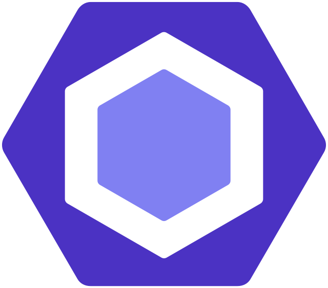

# Languages and Tools 💻

 

 

| IDE                                                   | Languages                                                             | Framework                             |                                             |
|-------------------------------------------------------|-----------------------------------------------------------------------|---------------------------------------|---------------------------------------------|
| [JetBrains](https://www.jetbrains.com/zh-cn/)         | [HTML](https://developer.mozilla.org/zh-CN/docs/Web/HTML)             | [Vue2](https://cn.vuejs.org/)         | [GitHub](https://github.com/)               |
| [WebStorm](https://www.jetbrains.com/zh-cn/webstorm/) | [CSS](https://developer.mozilla.org/zh-CN/docs/Web/CSS)               | [Vue3](https://v3.cn.vuejs.org/)      | [MDN](https://developer.mozilla.org/zh-CN/) |
| [Visual Studio Code](https://code.visualstudio.com/)  | [JavaScript](https://developer.mozilla.org/zh-CN/docs/Web/JavaScript) | [React](https://zh-hans.reactjs.org/) | [Markdown](https://markdown.com.cn/)        |
|                                                       | [TypeScript](https://www.typescriptlang.org/zh/)                      | [Angular](https://angular.cn/)        |                                             |

## [开源开发许可证 - 社区支持](https://www.jetbrains.com/zh-cn/community/opensource/#support)

#### JetBrains 通过为核心项目贡献者免费提供一套一流的开发者工具来支持非商业开源项目。

