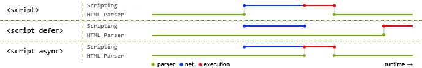

# 面试题

## HTML

### 1.src和href的区别

src用于替换当前元素，href用于在当前文档引用资源之间确立关系

1. src：src 是 source 的缩写，指向外部资源的位置，指向的内容将会嵌入到文档中当前标签所在位置；在请求 src 资源时会将其指向的资源下载并应用到文档内，例如 js 脚本，img 图片和 frame 等元素。当浏览器解析到该元素时，会暂停其他资源的下载和处理，直到将该资源加载、编译、执行完毕，图片和框架等元素也如此，类似于将所指向资源嵌入当前标签内。这也是为什么将js 脚本放在底部而不是头部。

2. href：href 是 Hypertext Reference 的缩写，指向网络资源所在位置，建立和当前元素（锚点）或当前文档（链接）之间的链接，如果在文档中添加 那么浏览器会识别该文档为 css 文件，就会并行下载资源并且不会停止对当前文档的处理。 这也是为什么建议使用 link 方式来加载 css，而不是使用@import 方式。

### 2.对HTML语义化的理解

语义化是指根据内容的结构化（内容语义化），选择合适的标签（代码语义化）。通俗来讲就是用正确的标签做正确的事情。

语义化的优点如下：

- 对机器友好，带有语义的文字表现力丰富，更适合搜索引擎的爬虫爬取有效信息，有利于SEO。除此之外，语义类还支持读屏软件，根据文章可以自动生成目录；

- 对开发者友好，使用语义类标签增强了可读性，结构更加清晰，开发者能清晰的看出网页的结构，便于团队的开发与维护。

### 3.DOCTYPE(⽂档类型) 的作用

DOCTYPE是文档类型声明，它的目的是告诉浏览器（解析器）应该以什么样（html或xhtml）的模式来渲染文档。它必须声明在HTML⽂档的第⼀⾏。

### 4.script标签中defer和async的区别

如果没有defer或async属性，浏览器会立即加载并执行相应的脚本。它不会等待后续加载的文档元素，读取到就会开始加载和执行，这样就阻塞了后续文档的加载。使用defer和async都会使得解析HTML的同时进行js脚本的异步下载，不会阻碍文档的解析，区别是，async在下载完js脚本之后立即执行js，有可能会阻碍文档的解析，且多个标记async的js脚本可能不会按照顺序执行；使用defer会在html解析完成之后再执行js脚本文件，而且多个defer的脚本会按照顺序执行。

### 5.常⽤的meta标签有哪些

meta 标签由 name 和 content 属性定义，用来描述网页文档的属性，比如网页的作者，网页描述，关键词等

常用的meta标签：

1. `charset`，用来描述HTML文档的编码类型：`<meta charset="UTF-8" >`

2. `keywords`，页面关键词：`<meta name="keywords" content="关键词" />`

3. `description`，页面描述：`<meta name="description" content="页面描述内容" />`

4. `refresh`，页面重定向和刷新：`<meta http-equiv="refresh" content="0;url=" />`

5. `viewport`，适配移动端，可以控制视口的大小和比例：`<meta name="viewport" content="width=device-width, initial-scale=1, maximum-scale=1">`

   其中，content 参数有以下几种：

    - width viewport ：宽度(数值/device-width)
    - height viewport ：高度(数值/device-height)
    - initial-scale ：初始缩放比例
    - maximum-scale ：最大缩放比例
    - minimum-scale ：最小缩放比例
    - user-scalable ：是否允许用户缩放(yes/no）

6. 搜索引擎索引方式：`<meta name="robots" content="index,follow" />`

   其中，content 参数有以下几种：

    - all：文件将被检索，且页面上的链接可以被查询；
    - none：文件将不被检索，且页面上的链接不可以被查询；
    - index：文件将被检索；
    - follow：页面上的链接可以被查询；
    - noindex：文件将不被检索；
    - nofollow：页面上的链接不可以被查询。

## CSS

## JavaScript

## ES6

## Vue
