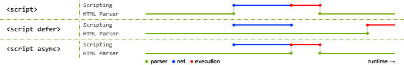

# 004 - defer和async的区别

#### 脚本调用策略

要让脚本调用的时机符合预期，需要解决一系列的问题。这里看似简单，实际大有文章。最常见的问题就是：HTML 元素是按其在页面中出现的次序调用的，如果用 JavaScript 来管理页面上的元素（更精确的说法是使用 文档对象模型 DOM），若
JavaScript 加载于欲操作的 HTML 元素之前，则代码将出错。

#### `async` 和 `defer`

上述的脚本阻塞问题实际有两种解决方案 —— `async` 和 `defer`。

浏览器遇到 `async` 脚本时不会阻塞页面渲染，而是直接下载然后运行。这样脚本的运行次序就无法控制，只是脚本不会阻止剩余页面的显示。当页面的脚本之间彼此独立，且不依赖于本页面的其它任何脚本时，async 是最理想的选择。

使用 `defer` 属性，脚本将按照在页面中出现的顺序加载和运行。

**脚本调用策略小结：**

- 如果脚本无需等待页面解析，且无依赖独立运行，那么应使用 `async`。

- 如果脚本需要等待页面解析，且依赖于其它脚本，调用这些脚本时应使用 `defer`，将关联的脚本按所需顺序置于 HTML 中。

如果没有 `defer` 或 `async` 属性，浏览器会立即加载并执行相应的脚本。它不会等待后续加载的文档元素，读取到就会开始加载和执行，这样就阻塞了后续文档的加载。

使用 `defer` 和 `async` 都会使得解析HTML的同时进行js脚本的异步下载，不会阻碍文档的解析，区别是

- `async` 在下载完js脚本之后立即执行js，有可能会阻碍文档的解析，且多个标记 `async` 的js脚本可能不会按照顺序执行。

- 使用 `defer` 会在html解析完成之后再执行js脚本文件，而且多个 `defer` 的脚本会按照顺序执行。

其中蓝色代表js脚本网络加载时间，红色代表js脚本执行时间，绿色代表html解析。
