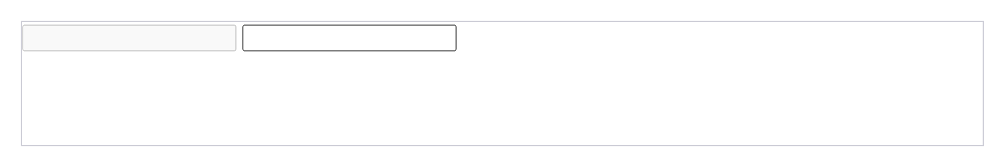

# HTML

## 简介

1. **HTML**（超文本标记语言——HyperText Markup Language）是构成 Web 世界的一砖一瓦。它定义了网页内容的含义和结构。除 HTML
   以外的其它技术则通常用来描述一个网页的表现与展示效果（如 [CSS](https://developer.mozilla.org/zh-CN/docs/Web/CSS)
   ），或功能与行为（如 [JavaScript](https://developer.mozilla.org/zh-CN/docs/Web/JavaScript)）。

2. “超文本”（hypertext）是指连接单个网站内或多个网站间的网页的链接。链接是网络的一个基本方面。只要将内容上传到互联网，并将其与他人创建的页面相链接，你就成为了万维网的积极参与者。

3. HTML 元素通过“标签”（tag）将文本从文档中引出，标签由在“`<`”和“`>`”中包裹的元素名组成，HTML 标签里的元素名不区分大小写。也就是说，它们可以用大写，小写或混合形式书写。例如，`<title>`
   标签可以写成 `<Title>`，`<TITLE>` 或以任何其他方式。

4. HTML(HyperText Markup Language) 不是一门编程语言，而是一种用来告知浏览器如何组织页面的**标记语言**。HTML 可复杂、可简单，一切取决于开发者。它由一系列的**
   元素（[elements](https://developer.mozilla.org/zh-CN/docs/Glossary/Element)）**组成，这些元素可以用来包围不同部分的内容，使其以某种方式呈现或者工作。
   一对标签（ [tags](https://developer.mozilla.org/zh-CN/docs/Glossary/Tag)）可以为一段文字或者一张图片添加超链接，将文字设置为斜体，改变字号，等等。

## 什么是 HTML?

[HTML](https://developer.mozilla.org/zh-CN/docs/Glossary/HTML) (HyperText Markup Language) 不是一门编程语言，而是一种用来告知浏览器如何组织页面的**
标记语言**。它由一系列的**元素（[elements](https://developer.mozilla.org/zh-CN/docs/Glossary/Element)）**
组成，这些元素可以用来包围不同部分的内容，使其以某种方式呈现或者工作。 一对标签（ [tags](https://developer.mozilla.org/zh-CN/docs/Glossary/Tag)
）可以为一段文字或者一张图片添加超链接，将文字设置为斜体，改变字号，等等。

> **注：**HTML 标签不区分大小写。也就是说，输入标签时既可以使用大写字母也可以使用小写字母。例如，标签`<title>`写作`<title>、<TITLE>、<Title>、<TiTlE>`
> ，等等都可以正常工作。不过，从一致性、可读性来说，最好仅使用小写字母。

让我们进一步探讨我们的段落元素：


这个元素的主要部分有：

1. **开始标签**（Opening tag）：包含元素的名称（本例为 p），被左、右角括号所包围。表示元素从这里开始或者开始起作用。
2. **结束标签**（Closing tag）：与开始标签相似，只是其在元素名之前包含了一个斜杠。这表示着元素的结尾。
3. **内容**（Content）：元素的内容，本例中就是所输入的文本本身。
4. **元素**（Element）：开始标签、结束标签与内容相结合，便是一个完整的元素。

### 块级元素和内联元素

在HTML中有两种你需要知道的重要元素类别，块级元素和内联元素。

- 块级元素在页面中以块的形式展现 ——
  相对于其前面的内容它会出现在新的一行，其后的内容也会被挤到下一行展现。块级元素通常用于展示页面上结构化的内容，例如段落、列表、导航菜单、页脚等等。一个以block形式展现的块级元素不会被嵌套进内联元素中，但可以嵌套在其它块级元素中。
- 内联元素通常出现在块级元素中并环绕文档内容的一小部分，而不是一整个段落或者一组内容。内联元素不会导致文本换行：它通常出现在一堆文字之间例如超链接元素`<a>`或者强调元素`<em>`和 `<strong>`。

### 空元素

不是所有元素都拥有开始标签，内容，结束标签。一些元素只有一个标签，通常用来在此元素所在位置插入/嵌入一些东西。例如：元素``是用来在元素``所在位置插入一张指定的图片。

> **注**: 空元素（Empty elements） 有时也被叫作 *void elements*.

## 属性

元素也可以拥有属性，如下：


属性包含元素的额外信息，这些信息不会出现在实际的内容中。在上述例子中，这个class属性给元素赋了一个识别的名字（id），这个名字此后可以被用来识别此元素的样式信息和其他信息。

一个属性必须包含如下内容：

1. 一个空格，在属性和元素名称之间。(如果已经有一个或多个属性，就与前一个属性之间有一个空格。)
2. 属性名称，后面跟着一个等于号。
3. 一个属性值，由一对引号“ ”引起来。

### 布尔属性

有时你会看到没有值的属性，它是合法的。这些属性被称为布尔属性，他们只能有跟它的属性名一样的属性值。例如[`disabled`](https://developer.mozilla.org/zh-CN/docs/Web/HTML/Element/Input#attr-disabled)
属性，他们可以标记表单输入使之变为不可用(变灰色)，此时用户不能向他们输入任何数据。

```
<input type="text" disabled="disabled">
```

方便起见，我们完全可以将其写成以下形式(我们还提供了一个非禁止输入的表单元素供您参考，以作为对比)：

```html
<!-- 使用disabled属性来防止终端用户输入文本到输入框中 -->
<input type="text" disabled>

<!-- 下面这个输入框没有disabled属性，所以用户可以向其中输入 -->
<input type="text">
```

上面两段HTML代码产生的效果如下：



## 剖析HTML文档

学习了一些HTML元素的基础知识，这些元素单独一个是没有意义的。现在我们来学习这些特定元素是怎么被结合起来，从而形成一个完整的HTML页面的：

```html
<!-- 声明文档类型。只需要知道 `<!DOCTYPE html>` 是最短有效的文档声明。 -->
<!DOCTYPE html>
<!-- 这个元素包裹了整个完整的页面，是一个根元素。 -->
<html lang="zh-CN">
<!-- 这个元素是一个容器，它包含了所有你想包含在HTML页面中但不想在HTML页面中显示的内容。
这些内容包括你想在搜索结果中出现的关键字和页面描述，CSS样式，字符集声明等等。 -->
<head>
    <!-- 这个元素设置文档使用utf-8字符集编码，utf-8 字符集包含了人类大部分的文字。
    基本上他能识别你放上去的所有文本内容。毫无疑问要使用它，并且它能在以后避免很多其他问题。 -->
    <meta charset="UTF-8">
    <meta http-equiv="X-UA-Compatible" content="IE=edge">
    <meta name="viewport" content="width=device-width, initial-scale=1.0">
    <!-- 设置页面标题，出现在浏览器标签上，当你标记/收藏页面时它可用来描述页面。 -->
    <title>网页的标题</title>
</head>
<!-- 包含了你访问页面时所有显示在页面上的内容，文本，图片，音频，游戏等等。 -->
<body>
<p>网页的主体内容，欢迎学习HTML！</p>
</body>
</html> 
```

## 实体引用： 在HTML中包含特殊字符

在HTML中，字符 `<`, `>`,`"`,`'` 和 `&` 是特殊字符. 它们是HTML语法自身的一部分, 那么你如何将这些字符包含进你的文本中呢, 比如说如果你真的想要在文本中使用符号&或者小于号,
而不想让它们被浏览器视为代码并被解释?

我们必须使用字符引用 —— 表示字符的特殊编码, 它们可以在那些情况下使用. 每个字符引用以符号&开始, 以分号(;)结束.

| 原义字符 | 等价字符引用  |
|------|---------|
| <    | \&lt;   |
| \>   | \&gt;   |
| ""   | \&quot; |
| ''   | \&apos; |
| &    | \&amp;  |

## HTML注释

如同大部分的编程语言一样，在HTML中有一种可用的机制来在代码中书写注释 —— 注释是被浏览器忽略的，而且是对用户不可见的，它们的目的是允许你描述你的代码是如何工作的和不同部分的代码做了什么等等。
如果你在半年后重新返回你的代码库，而且不能记起你所做的事情 —— 或者当你处理别人的代码的时候， 那么注释是很有用的.

为了将一段HTML中的内容置为注释，你需要将其用特殊的记号`<!--和-->`包括起来

## 基本结构

```html
<!--
    1、这是HTML的注释
    2、加上以下代码的第一行就表示HTML5。去掉就表示HTML4.0
    3、HTML不区分大小写，语法松散不严格。
-->
<!DOCTYPE html>
<!--网页的根标签,所有其它的标签都被包含-->
<html lang="zh-CN">
<!--头部标签,关于网页的一些配置信息-->
<head>
    <!-- 指定文档中字符的编码 -->
    <meta charset="UTF-8">
    <meta http-equiv="X-UA-Compatible" content="IE=edge">
    <meta name="viewport" content="width=device-width, initial-scale=1.0">
    <!--网页标题，显示在网页的左上角-->
    <title>网页的标题</title>
</head>
<!--主体标签,所有在浏览器中显示的其他的内容和标签都被包含-->
<body>
<p>网页的主体内容，欢迎学习HTML！</p>
</body>
</html> 
```

1. **开始标签**（Opening tag）：包含元素的名称，被左、右角括号所包围。表示元素从这里开始或者开始起作用 —— 在本例中即段落由此开始。
2. **结束标签**（Closing tag）：与开始标签相似，只是其在元素名之前包含了一个斜杠。这表示着元素的结尾 。初学者常常会犯忘记包含结束标签的错误，这可能会产生一些奇怪的结果。
3. **内容**（Content）：元素的内容
4. **元素**（Element）：开始标签、结束标签与内容相结合，便是一个完整的元素。

## 常用标签

- h1 ~ h6 标题标签 `<h1>标题</h1>`
- p 段落标签 `<p>段落</p>`
- br 换行标签 `<br>`
- hr 水平线 `<hr>`
- sup上标 `<sup></sup>`
- sub下标 `<sub></sub>`

## 实体标签

- `&nbsp; `空格
- `&lt;` 小于号 <
- `&gt;` 大于号 >
- `&copy;` 版权符号©
- `&#Unicode;` 编码表

## 语义化标签

**块元素**：块元素在页面中会独占一行，在网页中一般通过块元素来对页面进行布局

```html

<header>表示网页的头部，头部可以包含logo、导航、搜索框、广告条</header>
<main>表示网页的主体，一个网页中只有一个main标签</main>
<footer>表示网页的底部，底部可以包含版权声明</footer>
<nav>表示导航</nav>
<article>表示网页中一块内容（一般是一些文字的信息）</article>
<aside>表示侧边栏（辅助信息）</aside>
<section>表示一个区块</section>
<hgroup>表示一个标题组</hgroup>
<div>表示一个区块</div>
```

**行内元素（内联元素）**：在页面中不会独占一行，主要用来包裹文字

- 一般情况下会在块元素中方行内元素，而不会在行内元素中方块元素
- 块元素中基本什么都能放
- p元素中不能放任何的块元素

```html
<em>强调（语气）</em>
<strong>强调重要性</strong>
<i>斜体</i>
<b>加粗</b>
<q>短引用</q>
<blockquote>长引用</blockquote>
```

## 超链接

- 从链接可以让我们从一个页面跳转到其他页面，或者是当前页面的其他位置

- 使用a标签来定义超链接

- 超链接a标签也是行内元素，在a标签中可以嵌套除了它自身以外的任何元素

- 属性：

    - `href`：hot references 热引用。跳转的目标路径

    - 可以使一个外部地址，也可以是一个内部页面的地址

    -
        - 打开外部的页面

        -
            - `<a href="https://www.baidu.com">百度</a>`

        - 打开内部的页面

        -
            - `<a href="list.html">list</a>`

        - 跳转到页面的指定位置（锚点）

        -
            - `<a href="#id属性值">link</a>`

        - `target` 打开页面的位置

        -
            - `_self` 默认值 当前窗口打开
            - `_blank`在新窗口打开（慎用）

## meta标签

表示网页中的一些元数据

- 属性：
    - name：要设置的数据的名字
    - content：要设置的数据的值
    - http-equiv：设置Http协议的响应头

- 常用的功能：
    - 指定网页的字符集`<meta charset="UTF-8">`
    - 设置网页的描述信息`<meta name="description" content="这是一个不错的网站">`
    - 设置网页的关键字`<meta name="keywords" content="HTML5，前端，CSS3">`
    - 设置网页的重定向`<meta http-equiv="refresh" content="3;url=http://www.baidu.com">`

## 图片标签

- 作用：用来向网页中引入一个外部图片``

- 属性：

-
    - src：表示图片的路径
    - alt：表示图片的描述（主要用于搜索引擎识别图片的信息）
    - title：设置鼠标悬停时显示的信息
    - width：指定图片的宽度 设置图片宽度和高度的时候，只设置宽度，高度会进行等比例缩放。
    - height：指定图片的高度

- 相对路径

-
    - 目前我们使用的路径是相对路径（相对路径只能引入项目内部的资源）

    -
        - 相对路径是相当于当前文件所在的目录计算的
        - ./ 表示当前目录（可以省略）
        - ../ 表示上一级目录，返回几级就写几个

## 音视频标签

**audio**     标签用来向页面中引入一个外部的音频文件`<audio src="" controls autoplay loop></audio>`

- 音视频文件引入时，默认情况下不允许用户自己控制播放停止

- 属性：

-
    - controls 是否允许用户控制播放

    - autoplay 音频文件是否自动播放

    -
        - 如果设置了autoplay 则音乐在打开页面时会自动播放
        - 但是目前大部分浏览器都不会自动对音乐进行播放

    - loop 音乐是否循环播放

**video** 标签用来向页面中引入一个外部的视频文件`<video src="" controls autoplay loop></video>`

- 使用方式和audio基本一致

## 列表

**无序列表**

```html

<ul>
    <li>结构</li>
    <li>表现</li>
    <li>行为</li>
</ul
```

**有序列表**

```html

<ol>
    <li>结构</li>
    <li>表现</li>
    <li>行为</li>
</ol>
```

**定义列表**

- 使用dl标签来创建一个定义列表
- 使用dt来表示定义的内容
- 使用dd来对内容进行解释说明

> 列表之间可以相互嵌套

```html

<dl>
    <dt>结构</dt>
    <dd>结构表示网页的结构，用来规定网页中哪里是标签，哪里是段落</dd>
    <dd>结构表示网页的结构，用来规定网页中哪里是标签，哪里是段落</dd>
</dl>
```

## 表格

- 在网页张表格可以用来表示一些格式化的数据

- 表格相关的标签

    - `table`：用来创建一个表格
    - `tr`：表示表格中的一行
    - `td`：表示一个单元格，表格的列数，由td最多的那行决定
    - 属性：
        - `colspan` 横向的合并单元格
        - `rowspan` 纵向的合并单元格
    - `thead`：表格头部，用来放头部的tr
    - `tbody`：表格的主体，用来放主体的tr
        - 注意：如果创建表格时，没有指定tbody，则所有的td会自动添加到一个tbody
    - `tfoot`：表格的底部，用来放底部的tr
    - `th`：表头中的单元格

```html
  <!-- 用来创建一个表格 -->
<table>
    <!-- tr表示表格中的一行 -->
    <tr>
        <td>td表示一个单元格</td>
        <td>表格的列数，由td最多的那行决定</td>
        <td>如果创建表格时，没有指定tbody，则所有的td会自动添加到一个tbody</td>
    </tr>
</table>
```

## 表单（form）

- 表单用来将用户的数据提交给服务器
- 使用form标签来创建一个表单

```html
  <!-- action 请求提交的路径 -->
<form action="">
    <!-- 文本框 -->
    <input type="text">
    <!-- 密码框 -->
    <input type="password" name="" id="">
    <!-- 提交按钮 -->
    <input type="submit" value="">
    <!-- 重置按钮 -->
    <input type="reset" value="">
    <!-- 单选按钮 -->
    性别：<input type="radio" name="gender" id="male">男
    <input type="radio" name="gender" id="female" checked="checked">女
    <!-- 多选框 -->
    爱好<input type="checkbox" name="hobby" value="lq">篮球
    <input type="checkbox" name="hobby" value="ymq" checked>羽毛球
    <input type="checkbox" name="hobby" value="ppq">乒乓球
    <input type="checkbox" name="hobby" value="zq" checked>足球
    <!-- 下拉列表 -->
    你最喜欢的明星
    <select name="star" id="">
        <optgroup label="男明星">
            <option value="zbs">赵本山</option>
            <option value="ldh">刘德华</option>
            <option value="wyz" selected>吴彦祖</option>
        </optgroup>
        <optgroup label="女明星">
            <option value="fbb">范冰冰</option>
            <option value="zw">赵薇</option>
            <option value="lxr">林心如</option>
        </optgroup>
    </select>
    <!-- 文本域 -->
    <textarea name="" id="" cols="30" rows="10"></textarea>
</form>
```

```html
<!DOCTYPE html>
<html lang="en">

<head>
    <!-- 设置网页字符集 -->
    <meta charset="UTF-8">
    <meta http-equiv="X-UA-Compatible" content="IE=edge">
    <meta name="viewport" content="width=device-width, initial-scale=1.0">
    <title>Document</title>
</head>

<body>
以下都是块元素，块元素在页面中会独占一行，在网页中一般通过块元素来对页面进行布局
<header>表示网页的头部，头部可以包含logo、导航、搜索框、广告条</header>
<main>表示网页的主体，一个网页中只有一个main标签</main>
<footer>表示网页的底部，底部可以包含版权声明</footer>
<nav>表示导航</nav>
<article>表示网页中一块内容（一般是一些文字的信息）</article>
<aside>表示侧边栏（辅助信息）</aside>
<section>表示一个区块</section>
<hgroup>表示一个标题组</hgroup>
<div>表示一个区块</div>

行内元素：在页面中不会独占一行，主要用来包裹文字
<em>强调（语气）</em>
<strong>强调重要性</strong>
<i>斜体</i>
<b>加粗</b>
<q>短引用</q>
<blockquote>长引用</blockquote>
<br>
<a href="https://www.baidu.com" target="_blank">百度</a>
<br>
<audio src="" controls autoplay loop></audio>
<br>
<video src="" controls autoplay loop></video>
<br>
<ul>
    <li>无序列表</li>
    <li>无序列表</li>
    <li>无序列表</li>
</ul>
<ol>
    <li>有序列表</li>
    <li>有序列表</li>
    <li>有序列表</li>
</ol>
<dl>
    <dt>结构</dt>
    <dd>结构表示网页的结构，用来规定网页中哪里是标签，哪里是段落</dd>
    <dd>结构表示网页的结构，用来规定网页中哪里是标签，哪里是段落</dd>
</dl>

<!-- 用来创建一个表格 -->
<table border="1px">
    <!-- tr表示表格中的一行 -->
    <tr>
        <td>td表示一个单元格</td>
        <td>表格的列数，由td最多的那行决定</td>
        <td>如果创建表格时，没有指定tbody，则所有的td会自动添加到一个tbody</td>
    </tr>
</table>

<!-- action 请求提交的路径 -->
<form action="">
    <!-- 文本框 -->
    <input type="text"><br>
    <!-- 密码框 -->
    <input type="password" name="" id=""><br>
    <!-- 提交按钮 -->
    <input type="submit" value="提交"><br>
    <!-- 重置按钮 -->
    <input type="reset" value="重置"><br>
    <!-- 单选按钮 -->
    性别：<input type="radio" name="gender" id="male">男
    <input type="radio" name="gender" id="female" checked="checked">女<br>
    <!-- 多选框 -->
    爱好<input type="checkbox" name="hobby" value="lq">篮球
    <input type="checkbox" name="hobby" value="ymq" checked>羽毛球
    <input type="checkbox" name="hobby" value="ppq">乒乓球
    <input type="checkbox" name="hobby" value="zq" checked>足球<br>
    <!-- 下拉列表 -->
    你最喜欢的明星
    <select name="star" id="">
        <optgroup label="男明星">
            <option value="zbs">赵本山</option>
            <option value="ldh">刘德华</option>
            <option value="wyz" selected>吴彦祖</option>
        </optgroup>
        <optgroup label="女明星">
            <option value="fbb">范冰冰</option>
            <option value="zw">赵薇</option>
            <option value="lxr">林心如</option>
        </optgroup>
    </select><br>
    <!-- 文本域 -->
    <textarea name="" id="" cols="30" rows="10"></textarea>
</form>

</body>

</html>
```

## HTML标签企业级规范

1. 块元素与块元素平级，行内元素与行内元素平级
2. 块元素可以包含行内元素或某些块元素，行内元素不能包含块元素
3. 几个特殊块元素只能包含行内元素，不能包含块元素：`h1~h6 p dt`
4. 块元素不能放在`<p></p>`标签里
5. `li`标签可以包含`div`标签，它们都是装载内容的容器

## 前端知识广度SEO

SEO：搜索引擎优化

利用搜索引擎提高网站的“自然排名”，蜘蛛爬虫

### SEO优化

1. 重要的内容优先加载
    1. title：`<title></title>`
    2. 关键词：`<meta name="keywords" content="">`
    3. 描述：`<meta name="description" content="">`
2. 一个网站`<h1></h1>`标签只出现一次，重要性仅次于title
3. img标签加入alt属性：``
4. a链接通过`href`去跳转，尽量不要通过js去跳转
5. 网站404：不要出现死链接
