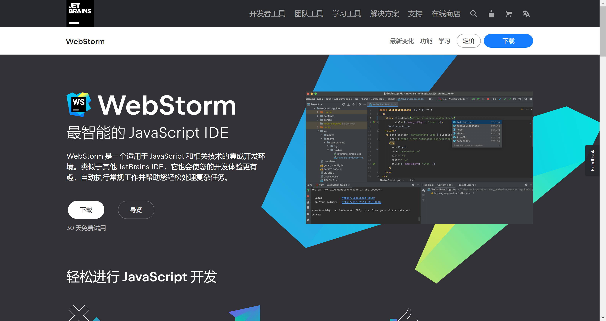
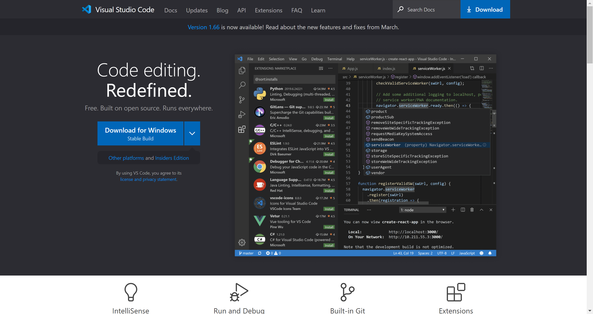
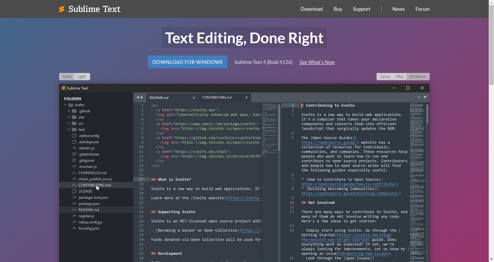
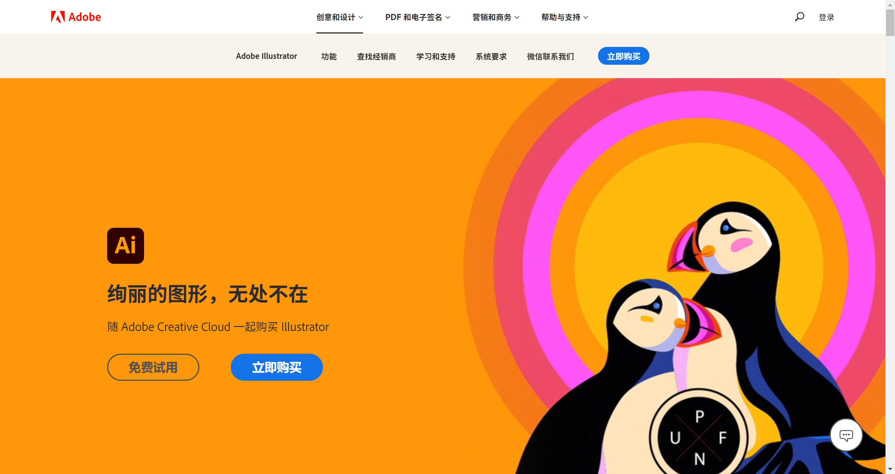

# Development Tools

## IDE

[WebStorm](https://www.jetbrains.com/zh-cn/webstorm/)

[Visual Studio Code](https://code.visualstudio.com/)

[Sublime Text](https://www.sublimetext.com/)

## 图形编辑器

[**Adobe Photoshop**](https://www.adobe.com/cn/products/photoshop.html)

[**Adobe Illustrator**](https://www.adobe.com/cn/products/illustrator.html)

## 版本控制工具

[Git](https://git-scm.com/)

[GitHub](https://github.com/)

## 自动化构建工具

[Webpack](https://webpack.docschina.org/)

## 浏览器

[Firefox](https://www.mozilla.org/zh-CN/firefox/)

[Chrome](https://www.google.cn/intl/zh-CN/chrome/)

[Opera](https://www.opera.com/zh-cn)

[Safari](https://www.apple.com.cn/safari/)

[Internet Explorer](https://windows.microsoft.com/en-us/internet-explorer/download-ie) 和 [Microsoft Edge](https://www.microsoft.com/zh-cn/edge)

