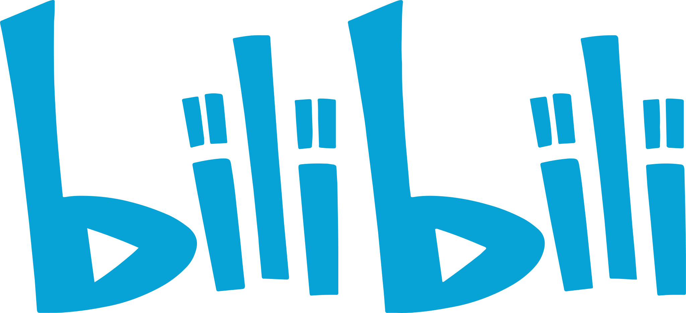

# 网站导航

## 常用

## 学习

## JetBrains

## Google

## Microsoft

[Microsoft 365 开发人员计划](https://developer.microsoft.com/zh-cn/microsoft-365/profile)  
[SharePoint 管理中心](https://junjieweb-admin.sharepoint.com/_layouts/15/online/AdminHome.aspx#/home)  
[Visual Studio Subscriptions](https://my.visualstudio.com/Benefits?mkt=zh-cn)  
[Microsoft 365 admin center](https://admin.microsoft.com/Adminportal/Home?source=applauncher#/homepage)  
[Windows Insider Blog](https://blogs.windows.com/windows-insider/)

## 编程语言排行榜

| [TIOBE Index](https://www.tiobe.com/tiobe-index/) | [编程语言排行榜](https://hellogithub.com/report/tiobe/) | [PYPL PopularitY of Programming Language](https://pypl.github.io/PYPL.html) |
|---------------------------------------------------|--------------------------------------------------|-----------------------------------------------------------------------------|
